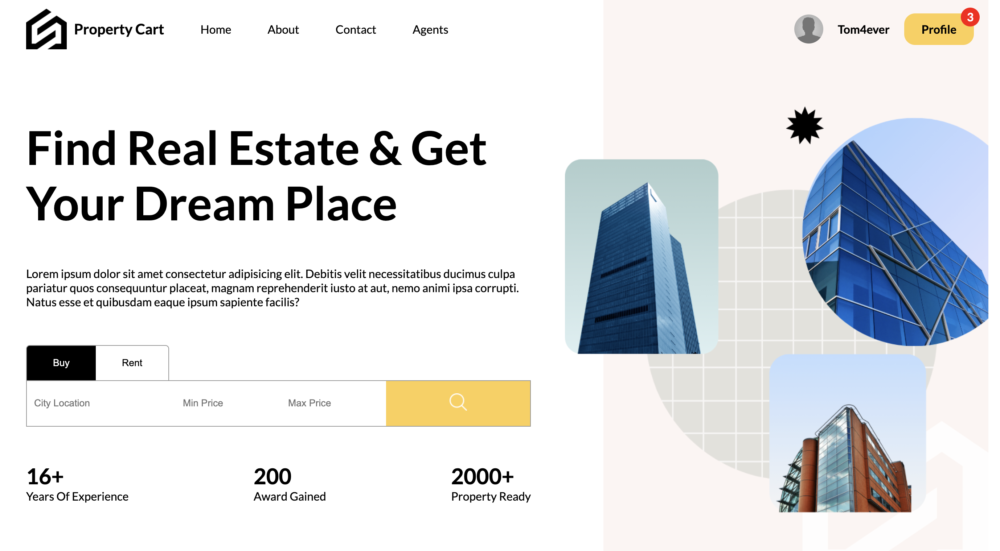

# PropertyCart

This is a web application designed to enable property owners to list their properties for rental purposes. It provides a user-friendly interface for property owners to input and manage their listings.

Key Features:

Property Listing: Property owners can easily input details about their properties, including location, size, amenities, and rental rates.
User-Friendly Interface: The application offers a simple and intuitive interface for both property owners and potential renters.
Data Storage: Property information is securely stored in a MongoDB database.
Technology Stack:

Frontend: React JS with Sass for efficient CSS styling
Backend: Express.js for routing and data management
Database: MongoDB for data storage

